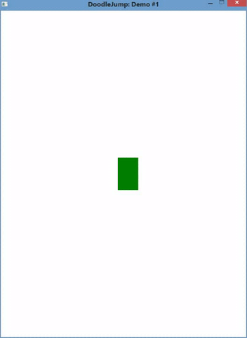

Этот пример поможет разобраться с созданием окна приложения, организацией цикла игры и перемещением персонажа в зависимости от нажатых клавиш.
Пример к статье [доступен на github](https://github.com/eligantRU/sfml-sample-doodlejump/tree/master/DoodleJump_1). Так он выглядит:



## Структура игры
В этом примере мы несколько упростим структуру кода, применив некоторые возможности C++, а в особенности - классы. Разумеется, не в полную силу, но достаточно, чтобы сделать код более читабельным.

Класс - это сущность, позволяющая объединить в себе переменные и функции и обладающая публичными(public) и приватными(private) полями и методами. Всем тем, что находится в public-части класса мы можем пользоваться за его пределами. Что же касается private-части, то её мы можем использовать лишь внутри данного класса.
Под полями класса подразумеваются переменные, под методами - функции.

Всё просто, не так ли?
Как правило, в публичной части содержится интерфейс для работы с классом, а в приватной скрыта его реализация. Этого подхода мы и будем придерживаться.

Заранее определим, что же такое игра. Игра - это экземпляр класса, у которого можно вызывать метод `DoGameLoop()`, внутри которого происходило бы следующее: очистка, обновление и отрисовка сцены. Разумеется, нужно также иметь возможность взаимодействовать с пользователем через клавиатуру.

```cpp
class CGame
{
public:
	CGame();

	void DoGameLoop();

private:
	void Update();
	void Render();

	void CheckEvents(); // здесь будет происходить взаимодействие с пользователем

	sf::RenderWindow m_window; // само окно, в котором происходит игра

	CDoodle m_hero; // главный герой - Дудлик
};
```

Итак, по порядку.
`CGame::CGame()` - конструктор класса - метод, вызывающийся автоматически при создании экземпляра класса. В нём мы и спрячем создание и настройку окна(включение вертикальной синхронизации и ограничение числа кадров в секунду):
```cpp
CGame::CGame()
	:m_window(sf::VideoMode(WINDOW_SIZE.x, WINDOW_SIZE.y), WINDOW_TITLE, WINDOW_STYLE)
{
	m_window.setVerticalSyncEnabled(true);
	m_window.setFramerateLimit(WINDOW_FRAME_LIMIT);
}
```

С первых строк становится понятно, что автор не любит магические выражения в коде и прибегает к помощи констант, которые заблаговременно разместил в файле `sheet.h`

Теперь разберёмся с тем, что происходит в этой строке:
```cpp
	:m_window(sf::VideoMode(WINDOW_SIZE.x, WINDOW_SIZE.y), WINDOW_TITLE, WINDOW_STYLE)
```

У класса `sf::RenderWindow` нет конструктора без параметров, он обязательно требует на вход `sf::VideoMode`, `sf::String` и `sf::Style`, потому приходится инициализировать его таким способом. Подробнее можете почитать [здесь](http://sfml-dev.org/documentation/2.4.1/classsf_1_1RenderWindow.php) и [здесь](http://cyberforum.ru/cpp-beginners/thread97847.html)

## Главный герой - Дудлик
Резонный вопрос - что же из себя представляет Дудлик? Отвечаем:
Дудлик - объект, для упрощения - прямоугольной формы, зелёного цвета, способный двигаться влево и вправо, который можно отрисовать в окне. По большей части его класс будет выполнять оборачивание над SFML:
```cpp
class CDoodle
{
public:
	CDoodle();

	void Update();
	void Draw(sf::RenderWindow & window);

	void UpdateDirection(bool isLeft, bool isRight);
	void SetDirection(const DirectionX & newDirection);
	DirectionX GetDirection() const;

	void SetPosition(const sf::Vector2f & pos);
	sf::Vector2f GetPosition() const;

	void Move(const sf::Vector2f & deltaPosition);

	sf::Vector2f GetOffset() const;

private:
	DirectionX m_direction = DirectionX::None;

	sf::RectangleShape m_body;
};
```

Для хранения направления был применён `enum class`:

```cpp
enum class DirectionX
{
	None = 0,
	Left,
	Right
};
```

> `enum class` хорош тем, что мы можем дать осмысленные имена перечислимым типам: `DirectionX direction = DirectionX::Left` выглядит гораздо прозрачнее, чем `int direction = 0`. Разница станет ещё более заметна в конструкциях `if`/`switch` - вместо магических чисел, которые могут легко забыться, будут осмысленные имена(живой пример будет ниже). Конечно, никто не запрещает держать в уме, что 0 - отсутствие направления по горизонтали, 1 - налево, 2 - направо...но разве не удобнее ли работать со словами None, Left, Right?

Надеюсь, вы заметили ключевое слово `const` после перечисления аргументов у некоторых методов, например `sf::Vector2f GetPosition() const;`. Здесь спецификатор `const` означает, что метод является константным, то есть не изменяет поля класса, то есть - для класса CDoodle - не изменяет состояние `m_direction` и `m_body`. Использование константных методов огораживает нас от человоческого фактора - если попытаться изменить поля класса в константном методе, то компилятор нам в вежливой(и не очень) форме даст понять, что мы делаем что-то не так.

## Цикл игры
```cpp
void CGame::DoGameLoop()
{
	while (m_window.isOpen())
	{
		CheckEvents();
		Update();
		Render();
		m_window.display();
	}
}
```

Здесь всё достаточно тривиально: пока окно открыто мы проверяем действия пользователя(например, нажатие управляющих клавиш и закрытие окна), затем обновляем сцену(двигаем Дудлика) и отрисовываем сцену в окне.

### Взаимодействие с пользователем
```cpp
void CGame::CheckEvents()
{
	sf::Event event;
	while (m_window.pollEvent(event))
	{
		CheckKeyboardEvents(event);

		if (event.type == sf::Event::Closed) // enum class удобно сравнивать
		{
			m_window.close();
		}
	}
}
```

При обработке нажатий клавиш мы будем "лениться" - запоминать нажатую клавишу. Если эта клавиша отвечала за движение Дудлика, то мы обновим направление движения Дудлика. В противном случае - ничего делать не будем.
Здесь же мы ради удобства добавим два новых поля класса - `m_isLeft` и `m_isRight`. Они нам нужны для того, чтобы точно знать, в какую сторону движется Дудлик:
```cpp
void CGame::CheckKeyboardEvents(const sf::Event & event)
{
	bool isNeedUpdate = false;
	CheckKeyPressed(event, isNeedUpdate);
	CheckKeyReleased(event, isNeedUpdate);

	if (isNeedUpdate)
	{
		m_hero.UpdateDirection(m_isLeft, m_isRight);
	}
}

void CGame::CheckKeyPressed(const sf::Event & event, bool & isNeedUpdate)
{
	if (event.type == sf::Event::KeyPressed)
	{
		switch (event.key.code) // и снова enum class
		{
		case sf::Keyboard::A:
			m_isLeft = true;
			isNeedUpdate = true;
			break;
		case sf::Keyboard::D:
			m_isRight = true;
			isNeedUpdate = true;
			break;
		default:
			break;
		}
	}
}

void CGame::CheckKeyReleased(const sf::Event & event, bool & isNeedUpdate)
{
	if (event.type == sf::Event::KeyReleased)
	{
		switch (event.key.code)
		{
		case sf::Keyboard::A:
			m_isLeft = false;
			isNeedUpdate = true;
			break;
		case sf::Keyboard::D:
			m_isRight = false;
			isNeedUpdate = true;
			break;
		default:
			break;
		}
	}
}
```

В методе `CGame::CheckKeyboardEvents()` был применён метод `CDoodle::UpdateDirection()`, вот и его реализация:
```cpp
void CDoodle::UpdateDirection(bool isLeft, bool isRight)
{
	if (isLeft)
	{
		SetDirection(DirectionX::Left);
	}
	else if (isRight)
	{
		SetDirection(DirectionX::Right);
	}
	else
	{
		SetDirection(DirectionX::None);
	}
}
```

### Обновление сцены
В `CGame::Update()` нужно обновлять всех участников сцены, в нашем случае он пока один - Дудлик:
```cpp
void CGame::Update()
{
	m_hero.Update();
}
```

### Отрисовка сцены
Аналогично:
```cpp
void CGame::Render()
{
	m_window.clear(WHITE);

	m_hero.Draw(m_window);
}
```

## Реализация Дудлика
Так как CDoodle выполняет главным образом задачу обёртки над SFML и нашим собственным типом DirectionX, то в нём будет много методов-однострочников:
```cpp
void CDoodle::Draw(sf::RenderWindow & window)
{
	window.draw(m_body);
}

void CDoodle::SetDirection(const DirectionX & newDirection)
{
	m_direction = newDirection;
}

DirectionX CDoodle::GetDirection() const
{
	return m_direction;
}

void CDoodle::SetPosition(const sf::Vector2f & pos)
{
	m_body.setPosition(pos);
}

sf::Vector2f CDoodle::GetPosition() const
{
	return m_body.getPosition();
}

void CDoodle::Move(const sf::Vector2f & deltaPosition)
{
	m_body.move(deltaPosition);
}
```

Из интересного здесь разве что конструктор, задающий внешний вид Дудлика:
```cpp
CDoodle::CDoodle()
{
	m_body.setFillColor(GREEN);
	m_body.setSize(DOODLE_SIZE);
	m_body.setPosition(DOODLE_INITIAL_POSITION);
}
```

Метод `void CDoodle::UpdateDirection(bool isLeft, bool isRight)` мы уже упоминали в разделе о взаимодействии с пользователем. У этого метода есть один недостаток - приоритет движению влево при одновременном нажатии клавиш, отвечающих за движение влево и вправо. Есть два варианта того, как разрешить эту дилемму: застопорить управление вовсе или считать последнее нажатие приоритетным. Исходя из соображений о том, что первый вариант реализуется гораздо проще, а второй требует некоторых финтов ушами, то пойдём по пути меньшего сопротивления.
```cpp
void CDoodle::UpdateDirection(bool isLeft, bool isRight)
{
	if (isLeft && isRight)
	{
		SetDirection(DirectionX::None);
	}
	else if (isLeft)
	{
		SetDirection(DirectionX::Left);
	}
	else if (isRight)
	{
		SetDirection(DirectionX::Right);
	}
	else
	{
		SetDirection(DirectionX::None);
	}
}
```

И у нас остаётся всё, что связано с методом Update:
```cpp
void CDoodle::Update()
{
	Move(GetOffset());
}

sf::Vector2f CDoodle::GetOffset() const
{
	return sf::Vector2f(GetHorizontalOffset(), GetVerticalOffset());
}
```

Всё? Ну...почти:
```cpp
float CDoodle::GetHorizontalOffset() const
{
	float positionX = 0;
	switch (GetDirection())
	{
	case DirectionX::Right:
		positionX += STEP;
		break;
	case DirectionX::Left:
		positionX -= STEP;
		break;
	default:
		break;
	}
	return positionX;
}

float CDoodle::GetVerticalOffset() const
{
	return 0;
}
```
Так как наш Дудлик пока может двигаться лишь по горизонтали, то `CDoodle::VerticalOffset()` будет всегда возвращать 0. В дальнейшем это изменится, когда мы научим Дудлика прыгать и падать.


## Эффект цилиндра
В заключение можно написать такую фичу как эффект цилиндра - вылетая за левую границу окна, Дудлик появляется справа; вылетая за правую границу окна, Дудлик появляется слева.
```cpp
void CGame::CheckCylinderEffect()
{
	auto doodlePosition = m_hero.GetPosition();
	if (doodlePosition.x <= -DOODLE_SIZE.x)
	{
		m_hero.SetPosition({ WINDOW_SIZE.x - DOODLE_SIZE.x, doodlePosition.y });
	}
	if (doodlePosition.x >= WINDOW_SIZE.x)
	{
		m_hero.SetPosition({ 0, doodlePosition.y });
	}
}
```
Стоп-стоп-стоп! `auto`?! Ну да, в C++ появилась возможность явно не указывать тип, если его можно предсказать по выражению справа. Например, возвращаемое функцией значение заранее известно(мы его явно указываем перед именем функции, когда её определяем) или же, очевидно, что 1.f - float, а 1.0 - double:
```cpp
auto example1 = 1.f; // auto ~ float
auto example2 = 1.0; // auto ~ double
auto example3 = 'c'; // auto ~ char
auto example4 = m_hero.GetPosition(); // auto ~ sf::Vector2f (CDoodle::GetPosition())
```

Осталось лишь вызвать наш новый метод в `CGame::Update()`:

```cpp
void CGame::Update()
{
	m_hero.Update();
	CheckCylinderEffect();
}
```

### Лирическое отступление
> "Да кому нужно это auto, я и сам всё хорошо помню!".

В языке C++ есть такие типы данных, которые занимают монитор-два-три в ширину. Думаю, дальше и продолжать не стоит, уже всё понятно. Однако стоит быть внимательным при использовании `auto` - типизацию никто не отменял.
```cpp
{
  auto example = "Lorem ipsum dolor sit amet";
  example = 14.f; // ошибка
}
```

Ну и моя самая любимая ошибка:
```cpp
{
  std::vector<int> example = { 0, 1, 2, 3 };
  for (auto i = 0; i < example.size(); ++i)
  {
    // ...
  }
}
```

Какого типа `i`? `size_t`? `unsigned`? `int`! Ещё и `example.size()` возвращает `size_t`, что может вызвать проблемы с диапазонами.

## Послесловие
К слову, `main()` выглядит как-то так:
```cpp
int main()
{
	CGame game;
	game.DoGameLoop();

	return 0;
}
```
