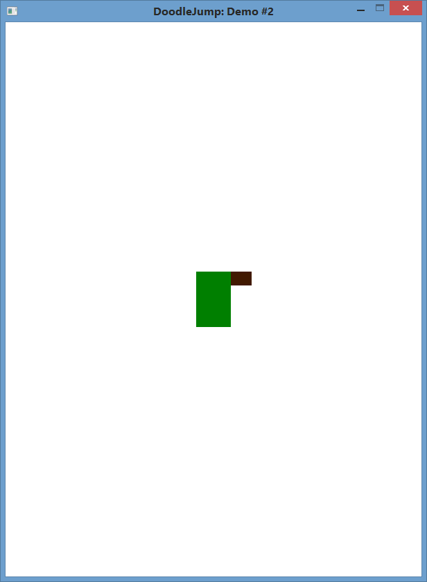
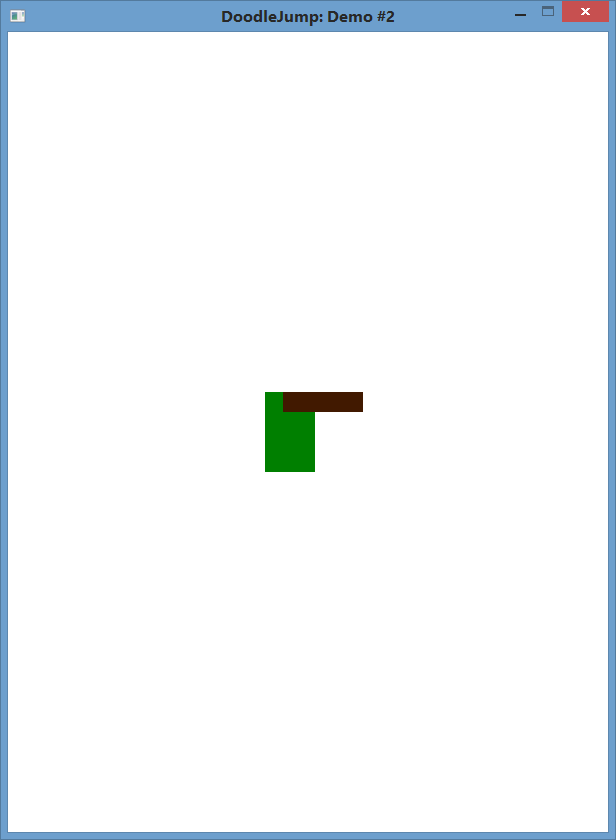
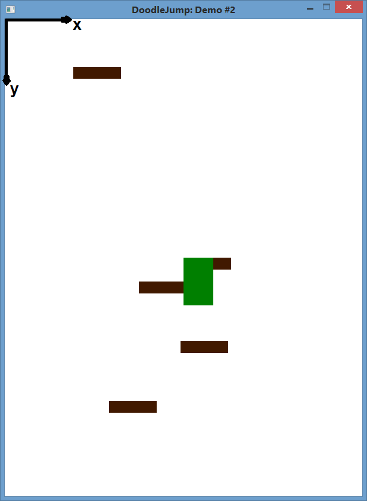
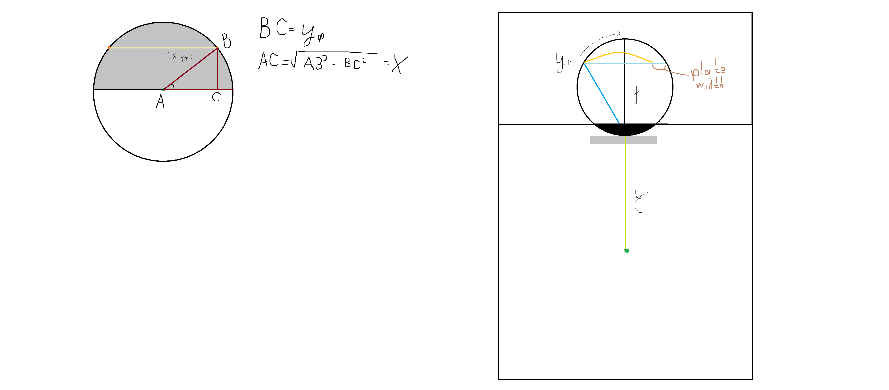
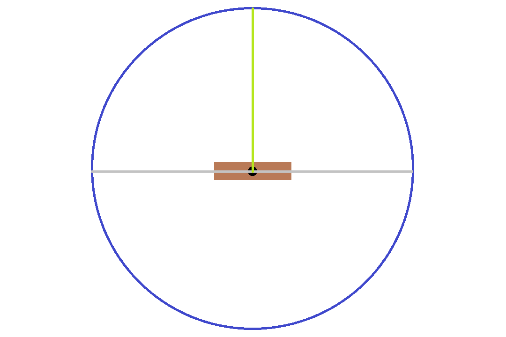
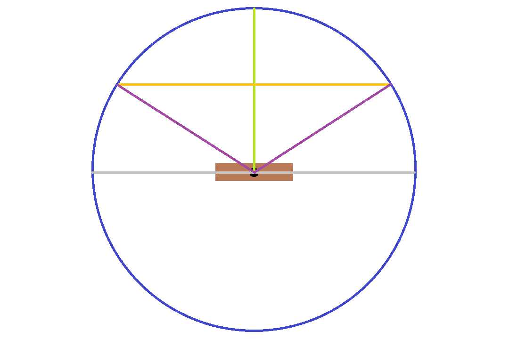

В этой статье мы дополним предыдущую генерацией плит. А чтобы задача мёдом не казалась - наложим дополнительные условия на генератор, но обо всём по порядку. Кстати, исходники к этой статье всё так же [недоступны на github](https://github.com/ps-group/sfml-doodlejump/tree/master/DoodleJump_2)

## Плиты
Как и в прошлой статье, распишем что же такое плита:
```cpp
class CPlate
{
public:
	CPlate();

	void Update() const;
	void Draw(sf::RenderWindow & window) const;

	void SetPosition(const sf::Vector2f & pos);
	sf::Vector2f GetPosition() const;

private:
	sf::RectangleShape m_body;
};
```
Методы представляют из себя однострочники, опустим их.

Сколько плит может быть одновременно на экране? Вопрос хороший. А главное, правильный ответ - n. Далее есть два пути: заценить возможное число плит и создать массив или генерировать плиты на лету, в зависимости от надобности, используя `std::vector`. Выберем первый вариант, т.к. он лучше подходит под нашу систему генерации плит, хотя если у вас возникнет желание или потребность во втором, то особых трудностей возникнуть не должно. Оценим число плит: WINDOW_SIZE.y / PLATE_SIZE.y - вариант расположения плит столбиком без наложений. Умножим на два, - скоро поймёте почему:

```cpp
#include <array>

class CGame
{
public:
	// Интерфейс не был изменён
private:
	// Аналогично - реализация
	std::array<CPlate, NUMBER_PLATES> m_plates;
};
```

Что ж, давайте спрячем все плиты за нижней границей окна(это и будет нашей инициализацией плит), а одну из плит установим в положение Дудлика. Сделаем мы это в конструкторе `CGame::CGame()`:
```cpp
CGame::CGame()
:m_window(sf::VideoMode(WINDOW_SIZE.x, WINDOW_SIZE.y), WINDOW_TITLE, WINDOW_STYLE)
{
	m_window.setVerticalSyncEnabled(true);
	m_window.setFramerateLimit(WINDOW_FRAME_LIMIT);

	for (auto & plate : m_plates)
	{
		// Спрячем все плиты за нижнюю границу экрана
		plate.SetPosition(sf::Vector2f(WINDOW_SIZE.x / 2.f,
		WINDOW_SIZE.y + DOODLE_INITIAL_POSITION.y));
	}
	// Установим одну плиту в координаты Дудлика
	m_plates[0].SetPosition(DOODLE_INITIAL_POSITION);
}
```
Запускаем наше приложение и...ничего не изменилось! А всё потому, что нужно в `CGame::Update()` и в `CGame::Render()` добавить строчки с обновлением и отрисовкой вектора плит:
```cpp
void CGame::Update()
{
	m_hero.Update();
	for (auto & plate : m_plates)
	{
		plate.Update();
	}
	CheckCylinderEffect();
}

void CGame::Render()
{
	m_window.clear(WHITE);

	for (const auto & plate : m_plates)
	{
		plate.Draw(m_window);
	}
	m_hero.Draw(m_window);
}
```

А вот и результат:



Отметим, что порядок вызова методов `Draw()` для объектов очень важен - он задаёт порядок отрисовки. Например, если бы мы сначала отрисовали Дудлика, а потом уже плиты, то у нас были бы наложения в духе:


## Камера
Давайте расставим несколько плит друг над другом где-нибудь неподалёку от Дудлика:
```cpp
CGame::CGame()
	:m_window(sf::VideoMode(WINDOW_SIZE.x, WINDOW_SIZE.y), WINDOW_TITLE, WINDOW_STYLE)
{
	// ...
	m_plates[0].SetPosition(DOODLE_INITIAL_POSITION);
	m_plates[1].SetPosition(sf::Vector2f(150, 600));
	m_plates[2].SetPosition(sf::Vector2f(200, 400));
	m_plates[3].SetPosition(sf::Vector2f(270, 500));
	m_plates[4].SetPosition(sf::Vector2f(90, 40));
	m_plates[5].SetPosition(sf::Vector2f(340, -100));
}
```
Стоп! Отрицательные координаты?! Ну да, а в чём проблема? Вот так будет выглядеть наше окно с плитами(для удобства - с координатными осями):



Очевидно, что в верхнем-левом углу находится точка с координатами (0, 0) - начало координат.

Резонный вопрос - добавили мы 6 плит, а видим 5. Где шестая? Она за верхней гранью окна, но как туда заглянуть? Для этого SFML предусматривает камеру:
```cpp
class CGame
{
public:
	// Интерфейс не изменён
private:
	// Аналогично - реализация
	sf::View m_view;
};

CGame::CGame()
	:m_window(sf::VideoMode(WINDOW_SIZE.x, WINDOW_SIZE.y), WINDOW_TITLE, WINDOW_STYLE)
{
	// ...
	m_view.reset(sf::FloatRect(0, 0, float(WINDOW_SIZE.x), float(WINDOW_SIZE.y)));
	// ...
}

void CGame::DoGameLoop()
{
	while (m_window.isOpen())
	{
		CheckEvents();
		Update();
		m_window.setView(m_view);
		Render();
		m_window.display();
	}
}

void CGame::Update()
{
	// ...
	m_view.setCenter(m_hero.GetPosition());
}
```

Можем поиграться двигая камеру из стороны в сторону - Дудлик будет оставаться в центре, а плиты - двигаться. Но всё-таки хотелось бы убедиться в существовании верхней плиты. Что ж, не проблема - пропишем увеличение и уменьшение координаты по Oy для Дудлика на клавиши W-S(временно, разумеется):
```cpp
class CGame
{
public:
	// Интерфейс не был изменён
private:
	// Аналогично - реализация
	float m_posY = DOODLE_INITIAL_POSITION.y;
};

void CGame::CheckKeyboardEvents(const sf::Event & event)
{
	bool isNeedUpdate = false;
	CheckKeyPressed(event, isNeedUpdate);
	CheckKeyReleased(event, isNeedUpdate);

	if (isNeedUpdate)
	{
		if (m_isUp)
		{
			m_posY -= STEP;
		}
		if (m_isDown)
		{
			m_posY += STEP;
		}
		m_hero.UpdateDirection(m_isLeft, m_isRight);
		m_hero.SetPosition(sf::Vector2f(m_hero.GetPosition().x, m_posY));
	}
}

void CGame::CheckKeyPressed(const sf::Event & event, bool & isNeedUpdate)
{
	if (event.type == sf::Event::KeyPressed)
	{
		switch (event.key.code)
		{
		case sf::Keyboard::A:
			m_isLeft = true;
			isNeedUpdate = true;
			break;
		case sf::Keyboard::D:
			m_isRight = true;
			isNeedUpdate = true;
			break;
		case sf::Keyboard::W:
			m_isUp = true;
			isNeedUpdate = true;
			break;
		case sf::Keyboard::S:
			m_isDown = true;
			isNeedUpdate = true;
			break;
		default:
			break;
		}
	}
}

void CGame::CheckKeyReleased(const sf::Event & event, bool & isNeedUpdate)
{
	if (event.type == sf::Event::KeyReleased)
	{
		switch (event.key.code)
		{
		case sf::Keyboard::A:
			m_isLeft = false;
			isNeedUpdate = true;
			break;
		case sf::Keyboard::D:
			m_isRight = false;
			isNeedUpdate = true;
			break;
		case sf::Keyboard::W:
			m_isUp = false;
			isNeedUpdate = true;
			break;
		case sf::Keyboard::S:
			m_isDown = false;
			isNeedUpdate = true;
			break;
		default:
			break;
		}
	}
}
```

## Генерация плит
Пожалуй, это было самое сложное за весь мой опыт разработки DoodleJump'а, ведь нужно было соблюсти следующие условия:
- Плит не должно быть много, иначе играть станет скучно
- Плит не должно быть мало, иначе играть будет невозможно
- Плиты должны генерироваться так, чтобы Дудлик всегда мог подниматься выше
- Плиты должны генерироваться так, чтобы можно было поставить фальш-плиту(ломающуюся, например)

Не могу сказать точно, сколько месяцев я бился над решением этой задачи, но вот решение, к которому я пришёл(оригинал от 11.03.2016):

Сложно? Понимаю...вас. А рисунок действительно пугает, но давайте всё же прибегнем к разуму: у нас есть некая начальная плита; координаты её заранее известны. Заключим эту плиту в окружность так, чтобы центр окружности совпадал с центром плиты.
Заметим, что радиус окружности равен [максимальному расстоянию](https://ru.wikipedia.org/wiki/Равноускоренное_движение), проходимому Дудликом, за прыжок минус высота плиты:


Теперь сгенерируем число, лежащее на отрезке от нуля до максимальной высоты прыжка Дудлика, это и будет смещение новой плиты по оси Oy относительно данной:
```cpp
auto offsetY = rand() % int(DOODLE_MAX_JUMP_HEIGHT);
auto offsetX = sqrt(DOODLE_MAX_JUMP_HEIGHT * DOODLE_MAX_JUMP_HEIGHT - offsetY * offsetY);
```
Смещение по Ox мы вычисляем, применив теорему Пифагора(вы ведь заметили прямоугольные треугольники, да?):

Итак, у нас есть две кандидатки на координату следующей плиты(пересечения фиолетовых отрезков с жёлтым), а ещё мы знаем, что корень всегда неотрицательный, а потому генерация плит будет всегда идти со смещением вправо. Исправим это, применив Великий Белорусский:
```cpp
if (rand() % 2)
{
	offsetX *= -1;
}
```
Отлично! Это всё? Ну..опять же - почти. Осталось создать саму плиту.

Помните, мы начали с координаты начальной плиты? Так вот, обзовём эту координату как `sf::Vector2f startingPoint`

```cpp
auto x = float(int(startingPoint.x + offsetX + WINDOW_SIZE.x - PLATE_SIZE.x)
               % int(WINDOW_SIZE.x - PLATE_SIZE.x));
auto y = startingPoint.y - offsetY;
```
Деление по модулю `(WINDOW_SIZE.x - PLATE_SIZE.x)` нужно для того, чтобы плиты не выходили за границы окна, а генерировались с противоположной стороны(помним про эффект циллиндра).
Да, кстати, надеюсь никто не забыл, что для корректного пользования `rand()` нужно выполнить `srand()`:
```cpp
int main()
{
	srand(unsigned(time(nullptr)));
	CGame game;
	game.DoGameLoop();

	return 0;
}
```

Теперь нужно постоянно генерировать новую плиту на основе той, которая расположена выше всех. Но постоянно генерировать плиты с нуля и удалять их, как только они покинули viewport, - дорого и неэффективно.
Можно вместо создания новой плиты переиспользовать те, которые уже покинули viewport, то есть остались где-то позади(вернее - ниже).

В конечном счёте, мы получим следующий код для генерации плит:
```cpp
void CGame::Update()
{
	m_hero.Update();
	for (auto & plate : m_plates)
	{
		plate.Update();
	}
	CheckCylinderEffect();

	m_view.setCenter(m_hero.GetPosition());

	GeneratePlates();
}

void CGame::GeneratePlates()
{
	auto viewPositionY = m_view.getCenter().y;
	for (int i = 0; i < NUMBER_PLATES; ++(++i))
	{
		if ((m_plates[i].GetPosition().y > viewPositionY + WINDOW_SIZE.y / 2) &&
		    (m_plates[i + 1].GetPosition().y > viewPositionY + WINDOW_SIZE.y / 2))
		{
			auto uppermostPlateID = GetUppermostPlateID();
			BuildPlate(uppermostPlateID, i);
			BuildPlate(uppermostPlateID, i + 1);
		}
	}
}

unsigned CGame::GetUppermostPlateIndex() const
{
	unsigned uppermostlPlateIndex = 0;
	for (auto i = 0; i < NUMBER_PLATES; ++i)
	{
		if (m_plates[i].GetPosition().y < m_plates[uppermostlPlateIndex].GetPosition().y)
		{
			uppermostlPlateIndex = i;
		}
	}
	return uppermostlPlateIndex;
}

void CGame::BuildPlate(const size_t basePlateID, const size_t replacingPlateID)
{
	auto startingPoint = GetCenterPlatePosition(basePlateID);
	auto offsetY = rand() % int(DOODLE_MAX_JUMP_HEIGHT);
	auto offsetX = sqrt(DOODLE_MAX_JUMP_HEIGHT * DOODLE_MAX_JUMP_HEIGHT - offsetY * offsetY);
	if (rand() % 2)
	{
		offsetX *= -1;
	}
	auto x = float(int(startingPoint.x + offsetX + WINDOW_SIZE.x - PLATE_SIZE.x)
	               % int(WINDOW_SIZE.x - PLATE_SIZE.x));
	auto y = startingPoint.y - offsetY;
	m_plates[replacingPlateID].SetPosition(sf::Vector2f(x, y));
}

sf::Vector2f CGame::GetCenterPlatePosition(const size_t plateID) const
{
	auto x = m_plates[plateID].GetPosition().x + PLATE_SIZE.x / 2;
	auto y = m_plates[plateID].GetPosition().y + PLATE_SIZE.y / 2;
	return sf::Vector2f(x, y);
}
```

Остановимся повнимательнее на двух методах: `CGame::GetUppermostPlateID()` и `CGame::GetUppermostPlateID()`:
```cpp
void CGame::GeneratePlates()
{
	auto viewPositionY = m_view.getCenter().y;
	for (int i = 0; i < NUMBER_PLATES; ++(++i))
	{
		if ((m_plates[i].GetPosition().y > viewPositionY + WINDOW_SIZE.y / 2) &&
		    (m_plates[i + 1].GetPosition().y > viewPositionY + WINDOW_SIZE.y / 2))
		{
			auto uppermostPlateID = GetUppermostPlateID();
			BuildPlate(uppermostPlateID, i);     // основная плита
			BuildPlate(uppermostPlateID, i + 1); // возможность для фальш-плиты
		}
	}
}
```
Согласитесь, иметь возможность безболезненно создать ломающуюся плиту, которая бы по своей генерации ничем бы не отличалась от основной плиты, да ещё и на второй итерации...Это многого стоит!
Кстати, именно для этого мы и домножали ожидаемое число плит на два, ведь вторая плита может оказаться на одной высоте с первой.

Здесь же мы находим плиту, находящуюся выше других, и возвращаем её индекс:
```cpp
unsigned CGame::GetUppermostPlateIndex() const
{
	unsigned uppermostlPlateIndex = 0;
	for (auto i = 0; i < NUMBER_PLATES; ++i)
	{
		if (m_plates[i].GetPosition().y < m_plates[uppermostlPlateIndex].GetPosition().y)
		{
			uppermostlPlateIndex = i;
		}
	}
	return uppermostlPlateIndex;
}
```

Спрашивается, - а зачем находить индекс плиты, которая находится выше других? Во-первых, чтобы генерировать плиты вверх, а не вниз. Во-вторых, чтобы новые плиты не оказывались во viewport'е(согласитесь, будет непонятно, если плиты будут генерировать на глазах пользователя).

# Заключение
Генерацию плит можно улучшить после добавления очков. Как? Да очень просто - чем больше очков, тем точки-"кандидатки" на координату новой плиты ближе к верхней точке окружности.
Подсказка: функция корня, тангенса и обратного гиперболического синуса и косинуса. Но может у вас получится алгоритм получше моего, экспериментируйте!
