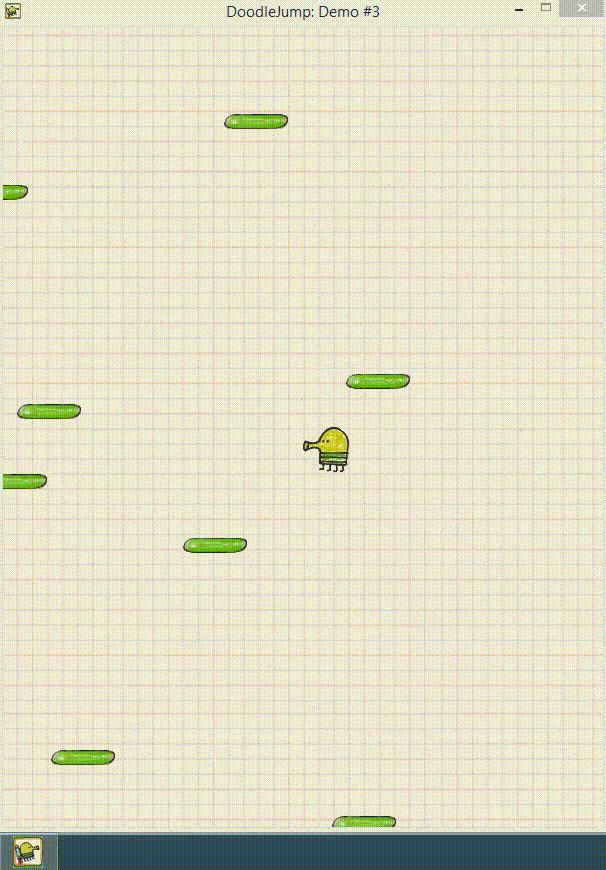

В этой статье мы добавим текстуры в нашу игру, а также иконку для окна приложения.
Исходники к этой статье всё так же [доступны на github](https://github.com/eligantRU/sfml-sample-doodlejump/tree/master/DoodleJump_3)



## Предупреждение
Между этой и предыдущей статьёй была добавлена зависимость от времени между кадрами, которая была описана в [статье ранее](https://github.com/eligantRU/ps-group.github.io/blob/master/_escape_from_js/4.md)

## Где и как хранить текстуры?
Создадим структуру `CAssets` для наших ресурсов, которой зададим конструктор, в котором проиницилизируем все поля(текстуры, шрифты и пр.), ну и опишем публичные поля для самих asset'ов.
Инициализация достаточно проста:
```cpp
CAssets::CAssets()
{
	AddRepeatedTexture(BACKGROUND_TEXTURE, "images/background.png");
	AddTexture(DOODLE_LEFT_TEXTURE, "images/Doodle45_45Left.png");
	AddTexture(DOODLE_RIGHT_TEXTURE, "images/Doodle45_45Right.png");
	AddTexture(PLATE_STATIC_TEXTURE, "images/Plate_63_15_Green.png");

	AddFont(ARIAL_FONT, "arial.ttf");
	AddImage(WINDOW_ICON, "images/icon.png");
}
```

Разве что, если не учесть то, что все вызванные функции на самом-то деле методы этого же класса. Разберёмся, почему так.
Текстуры, шрифты, аудио-файлы подгружаются из определённого места из файловой системы, что уже как бы намекает на то, что их может не оказаться в ожидаемом нами месте.
```cpp
void CAssets::AddTexture(sf::Texture & texture, const std::string & path)
{
	if (!texture.loadFromFile(path))
	{
		MessageBoxA(nullptr, std::string("File " + path + " not founded").c_str(), "Error", MB_ICONERROR | MB_OK);
		_exit(-1);
	}
	texture.setSmooth(true);
	texture.setRepeated(false);
}
```
Примерно так мы подгружаем текстуру, которая не должна повторяться при избыточном размере контейнера, в котором она располагается. Эдакий `background` в CSS.
К слову, `MessageBoxA` был взят из `windows.h`, который придётся подключить в заголовочном файле `stdafx.h`. При вызове этой функции создаётся MessageBox с нашим сообщением и кнопками. Т.к. это средство WinAPI, то теперь наша игра запускается только на Windows. Желающие это исправить могут покопать в `Boost` и `Qt`, но сейчас не об этом.

Повторяющуюся текстуру, например, для фона, добавляем через уже описанный нами метод-загрузчик:
```cpp
void CAssets::AddRepeatedTexture(sf::Texture & texture, const std::string & path)
{
	AddTexture(texture, path);
	texture.setRepeated(true);
}
```

Как подгрузить картинку и шрифты? Копипастой!
```cpp
void CAssets::AddFont(sf::Font & font, const std::string & path)
{
	if (!font.loadFromFile(path))
	{
		MessageBoxA(nullptr, std::string("File " + path + " not founded").c_str(), "Error", MB_ICONERROR | MB_OK);
		_exit(-1);
	}
}

void CAssets::AddImage(sf::Image & image, const std::string & path)
{
	if (!image.loadFromFile(path))
	{
		MessageBoxA(nullptr, std::string("File " + path + " not founded").c_str(), "Error", MB_ICONERROR | MB_OK);
		_exit(-1);
	}
}
```

## Текстуры есть, как использовать?
Создаём поле `m_assets` в CGame, и пропихиваем его всюду, где нужны текстуры: в CPlate, CDoodle, - например, так:
```cpp
CDoodle::CDoodle(CAssets & assets)
  	:m_assets(assets)
```

Учтём, что текстуры применяются к `sf::Sprite`, так что от `sf::RectangleShape` нам придётся отказаться. Но не волнуйтесь, придётся лишь поменять тип данных и убрать задание цвета и размеров, - всё остальное будет работать.

Текстуры несложно использовать, распишу на примере Дудлика:
```cpp
CDoodle::CDoodle(CAssets & assets)
	:m_assets(assets)
{
	m_body.setPosition(DOODLE_INITIAL_POSITION);
	SetTexture(m_assets.DOODLE_RIGHT_TEXTURE);
}

void CDoodle::SetTexture(const sf::Texture & texture)
{
	m_body.setTextureRect(sf::IntRect(0, 0, int(texture.getSize().x), int(texture.getSize().y)));
	m_body.setTexture(texture);
}

void CDoodle::UpdateDirection(bool isLeft, bool isRight)
{
	if (isLeft && isRight)
	{
		SetDirection(DirectionX::None);
	}
	else if (isLeft)
	{
		SetDirection(DirectionX::Left);
		SetTexture(m_assets.DOODLE_LEFT_TEXTURE);
	}
	else if (isRight)
	{
		SetDirection(DirectionX::Right);
		SetTexture(m_assets.DOODLE_RIGHT_TEXTURE);
	}
	else
	{
		SetDirection(DirectionX::None);
	}
}
```

С плитам ещё проще - один раз задать текстуру в конструкторе, и никаких проблем. Однако всплывает проблема - мы не можем создавать элементы для `std::array`, у которых нет конструктора без параметров. Что ж, очень жаль, будем использовать `std::vector`:
```cpp
CGame::CGame()
	:m_window(sf::VideoMode(WINDOW_SIZE.x, WINDOW_SIZE.y), WINDOW_TITLE, WINDOW_STYLE)
	,m_hero(m_assets)
{
  // ...
	for (int i = 0; i < NUMBER_PLATES; ++i)
	{
		CPlate plate(m_assets);
		plate.SetPosition(PLATE_INITIAL_POSITION);
		m_plates.push_back(plate);
	}
  // ...
}
```

Ах, да. Неплохо бы добавить фон для игры, раз уж мы грузим текстуру с фоном:
```cpp
CGame::CGame()
	:m_window(sf::VideoMode(WINDOW_SIZE.x, WINDOW_SIZE.y), WINDOW_TITLE, WINDOW_STYLE)
	,m_hero(m_assets)
{
  // ...
	m_background.setTextureRect(sf::IntRect(0, 0, WINDOW_SIZE.x, WINDOW_SIZE.y));
	m_background.setTexture(m_assets.BACKGROUND_TEXTURE);
}

void CGame::Update(float dt)
{
	m_hero.Update(dt);
	for (auto & plate : m_plates)
	{
		plate.Update(dt);
	}
	CheckCylinderEffect();

	m_background.setPosition(m_hero.GetPosition() - 0.5f * sf::Vector2f(WINDOW_SIZE));
	m_view.setCenter(m_hero.GetPosition());

	GeneratePlates();
}

void CGame::Render()
{
	m_window.clear(WHITE);

	m_window.draw(m_background);

	for (const auto & plate : m_plates)
	{
		plate.Draw(m_window);
	}
	m_hero.Draw(m_window);
}
```

## Иконка окна приложения
Как создавать красивый "ярлычок" для нашего exe'шника узнаем позже, а создать иконку, которая будет отображаться в уголке окна и на taskbar'е, - не проблема уже сейчас:
```cpp
CGame::CGame()
	:m_window(sf::VideoMode(WINDOW_SIZE.x, WINDOW_SIZE.y), WINDOW_TITLE, WINDOW_STYLE)
	,m_hero(m_assets)
{
  // ...
	const auto icon = m_assets.WINDOW_ICON;
	m_window.setIcon(icon.getSize().x, icon.getSize().y, icon.getPixelsPtr());
  // ...
}
```
