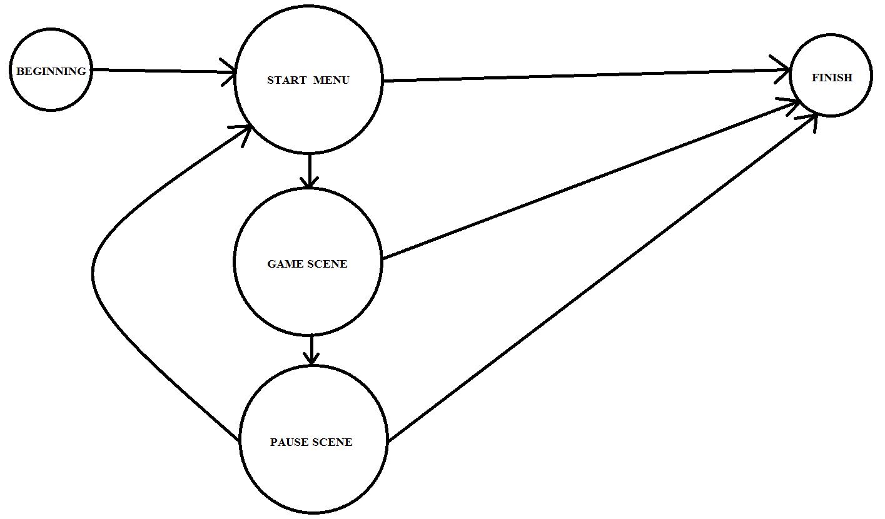

В этой статье мы разделим всю игру на отдельные сцены, что позволит нам создавать, например, меню.
Исходники к этой статье всё так же [доступны на github](https://github.com/eligantRU/sfml-sample-doodlejump/tree/master/DoodleJump_4)

## Вдохновляемся автоматами
Итак, что мы имеем? Опираясь на предудыщий пример - окно, в котором Дудлик летит вверх. Допустим, что в нём уже прописано падение, бонусы, враги и прочее. Но что насчёт паузы? Стартового экрана? Они не менее важны, чем сама игра, однако к самой игре отношения они никакого не имеют, хотя и всем очевидно, что сначала открывается стартовый экран, из которого можно попасть на игровую сцены, из которого можно попасть либо в сцену поражения, либо в сцену паузы.
Что-то напоминает, не так ли? Например, автомат, при чём конечный. Однако, над понятием автомата мы немного надругаемся ради нашего же блага, но обо всём по порядку:


## Варианты реализации сцен
* Оставить всё как есть, добавить пару флагов, покрыть CheckEvents, Update и Render if'ами, докинув в CGame пару десятков полей для кнопок, текста и пр.
* Предыдущий вариант с применением идиомы pImpl, и сопутствующим выносом кода по разным файлам
* Модификая второго варианта с разбиением CGame на отдельные классы сцен

Первый вариант сложно поддерживать, второй вариант в данном случае походит на костыль, а вот третий очень даже неплох!

## Архитектура и ограничения
Ради примера добавим в наш DoodleJump сцену паузы, на стартовый экран и Game Over пока что подзабьём, если что - добавить их будет несложно.
Для начала вынесем всё, что было связано с игрой в некую сущность `CGameScene`, настроим взаимодействие с `CGame`, работает, отлично.
Добавим щепотку логику: сцена - сущность, которую можно "продвинуть". Каждый раз при таком продвижении в зависимости от текущего состояния сцены будет выбрана следующая сцена. По умолчанию - следующая сцена - текущая.

## Реализация
Создадим `enum` с типами сцен:
```cpp
enum class SceneType
{
	GameScene = 0,
	PauseScene,
};
```

Создадим сущность, которая будет возвращаться при каждом продвижении сцены:
```cpp
struct SceneInfo
{
public:
	SceneInfo() = delete;
	SceneInfo(SceneType type)
		:nextSceneType(type)
	{}

	SceneType nextSceneType;
};
```
Да, одно поле, однако через такой объект в дальнейшем можно организовать и определённое общение между сценами, хотя для того есть и более подходящие варианты.

Несколько модифицируем наш `CGame::DoGameLoop`:
```cpp
void CGame::DoGameLoop()
{
	SceneInfo info = SceneInfo(SceneType::GameScene);
	while (m_window.isOpen())
	{
		const auto dt = m_clock.restart().asSeconds();

		switch (info.nextSceneType)
		{
		case SceneType::GameScene:
			info = m_gameScene.Advance(dt);
			break;
		case SceneType::PauseScene:
			info = m_pauseScene.Advance(dt);
			break;
		}
	}
}
```
Здесь мы выбрали первую сцену для показа и собрали воедино логику смены сцен.
> Моя давняя мечта здесь же делать display() и проверять общие события(например, закрытие окна), но вдруг по каким-то причинам поведение должно быть особенным? Например, если у нас 2+ окна...оставим как есть.

Теперь поговорим о том, что теперь скрывается в методах `Advance` на примере `CGameScene`:
```cpp
SceneInfo CGameScene::Advance(float dt)
{
	m_nextSceneType = SceneType::GameScene;
	CheckEvents();
	Update(dt);
	m_window.setView(m_view);
	Render();
	m_window.display();

	return SceneInfo(m_nextSceneType);
}
```
Мы инициализируем следующую сцену текущей сценой. Затем проверяем события, например, нажатие на ESC, которое должно отправить нас в меню паузы(там же мы и заменим значение следующей сцены на паузу).
Затем выполняем Update для сцены, устанавливаем камеру, рисуем всё и вся, после чего возвращаем информацию о следующей сцене - какая она должна быть.

## Камера
Если вы читаете код параллельно статье, то вас могло смутить то, что мы установили окну камеру в конкретной сцене, а не в `CGame`. Более того, каждая сцена имеет свою камеру, как так? Что ж, настал тот час для открытия страшной тайны - камер может быть несколько. В моём прошлом проекте была одна камера...вспоминаю эти конструкции для корректного отображения всех сцен...не надо так :)

## Кнопка
Просто кнопка. Взята из моего предыдущего проекта. Не лучшая реализация, не так хорошо абстрагирована, как хотелось бы, а потому описываться здесь не будет, дабы по сотне раз статью не править. Использовать можно, решение рабочее, проверенное временем, но знайте, что можно лучше.
