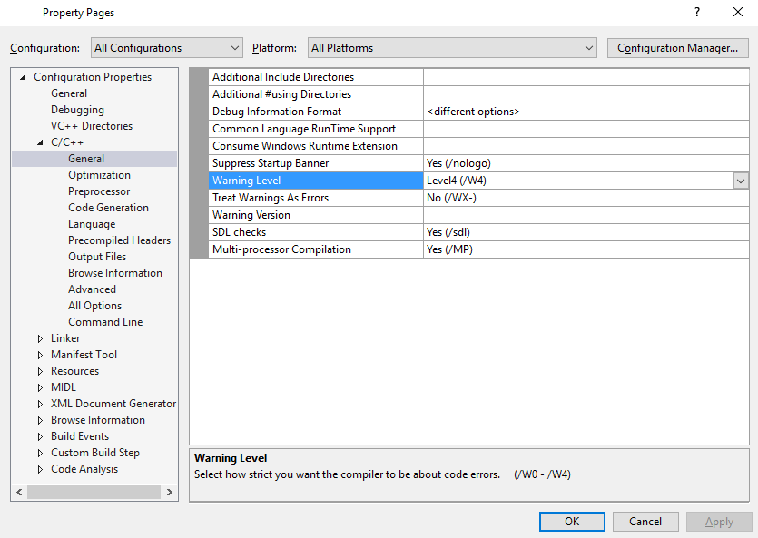
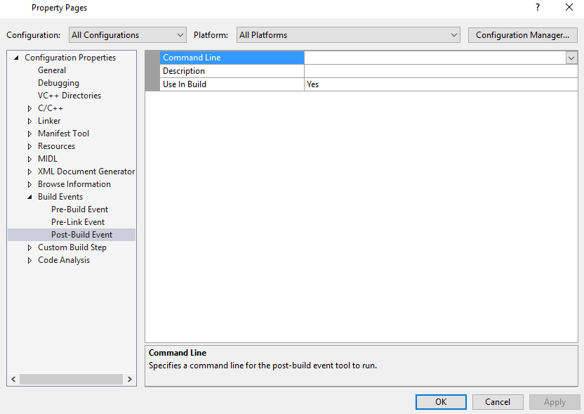

## Тернарный оператор
Опять же, всё как в JS, поэтому опустим резиновые примеры и сразу перейдём к тому, что такое хорошо и что такое плохо.
Тернарый оператор не должен выполнять никакой логики отличной от "выбор одного значения из двух возможных".
Рассмотрим на примере факториала:
```cpp
unsigned Factorial(unsigned n)
{
  return (n != 0) ? (Factorial(n - 1) * n) : 1;
}
```

Никакой лишней логики: только красота и прозрачность.
Однако если ваш тернарный оператор выполняет печать текста в `std::cout` или что-то ещё выходящее за рамки "выбор из двух", то лучше разбейте его на `if-else`.

## Включаем предупреждения компилятора
Устанавливаем в `Property Manager` Warnning Level в значение `/W4`. Отныне, компилятор начнёт нам говорить о неиспользуемых переменных, неявных приведениях типов и прочих последствий человеческой невнимательности.


## Правим предупреждения компилятора
```cpp
void DoSth(float value) {}

int main()
{
  int a = 0;
  DoSth(4.5);
}
```

Что скажет нам компилятор?
1) Неиспользуемая переменная `a`
2) `DoSth()` принимает `float`, а пришёл `double`: пришлось преобразовывать `double` ко `float`, что чревато потерей точности
3) value в `DoSth()` не используется

Правим:
1) Удаляем `int a = 0;`
2) Явно приведём 4.5(`double`) к `float`: `DoSth(float(4.5));`. Можно, конечно, написать 4.5f, однако если бы значение нам приходило бы из какой-то другой функции, которая бы возвращала `float`, то мы бы так сделать уже не смогли.
3) Здесь есть два способа решения проблемы:
3.1) `void DoSth(float) {}` - удалить имя переменной
3.2) `void DoSth(float value) { (void)&value; }` - явно сказать, что `value` здесь не используется. Лично я предпочитаю второй способ, т.к. сразу понятно, что принимает функция(из имени и типа), а в первом случае у нас есть только тип, а имени нет...и что делать - непонятно.

```cpp
void DoSth(float value) { (void)&value; }

int main()
{
  DoSth(float(4));
}
```

> Можно преобразовать тип и в стиле C++: `static_cast<float>(4)` - так мы получили из 4(`int`) 4.f(`float`). Этот способ мне и нравится, и не нравится одновременно. Нравится тем, что это в стиле C++, а не нравится тем, что занимает больше места в коде: зачем писать `static_cast<float>(4)`, если можно написать `float(4)`? Спорная ситуация - решение за вами.

## Удобное расположение репозиториев и подключаемых библиотек
Лично у меня сделано как-то так: в корне диска есть директория `!git`, в которой у меня и лежат все-все Git-репозитории. И мне не приходится думать, куда я склонировал репозиторий, где же он лежит среди RAID-массива на 16 ТБ, - он лежит где-то в `!git` на диске `E`, там и стоит искать.

Что же касательно библиотек, то у меня на SSD(который я использую в основном как `read only`) есть директория `sdk`, в которой у меня лежат все библиотеки. И аналогично, я не ищу каждую библиотеку по всему RAID'у.
Бывают, конечно, ситуации, когда библиотеку нельзя скачать готовой, приходится её выкачивать с Github-репозитория, собирать и...и копировать все собранные файлы в ту самую директорию `sdk`, создав для новой библиотеки в ней новую поддиректорию - удобно.
К чему это я? VisualStuido позволяет объявлять свои макросы, которые можно применить в `Property Manager`. И в итоге подключать библиотеки придётся не кучей строк, которые начинаются одинаково, а примерно так:
```
$(LIB_PATH)SFML/include
$(LIB_PATH)SDL/include
$(LIB_PATH)GLM/include
```
```
$(LIB_PATH)SFML/lib
$(LIB_PATH)SDL/lib
$(LIB_PATH)GLM/lib
```

Удобно? Удобно.
Вы уже могли встретиться с тем, что есть `Debug` и `Release` версии для библиотек. Макрос `$(Configuration)` поможет вам.
`x64` или `x86`? Их опять же можно описать с помощью макроса `$(PlatformTarget)`

Как я уже отписал выше, библиотеки я подключаю "примерно так", т.е. немного приврал, потому что на самом-то деле так:
```
$(LIB_PATH)SFML/lib/$(PlatformTarget)$(Configuration)
$(LIB_PATH)SDL/lib/$(PlatformTarget)$(Configuration)
$(LIB_PATH)GLM/lib/$(PlatformTarget)$(Configuration)
```

А `include` всегда одинаковый, от него даже при особом желании можно избавиться, но у перед нами сейчас нет такой задачи.
Ещё вы могли заметить, что ваши `*.exe` файлы не очень-то и хотят запускаться без каких-то там DLL-файлов. Есть такое-понятие, как `Build Events` - события, которые сработают при определённых этапах сборки.

Здесь в `Command Line` можно описать с помощью команд `CMD` и макросов можно описать копирование библиотек.
Избавлю вас от хождения по моим граблям в виде поиска нужных макросов, команд и флагов для них:
* xcopy /Y /E /I
* $(TargetDir)

С помощью этих команд и макросов вы сможете подтянуть DLL из `$(LIB_PATH)SFML/bin/$(Configuration)` к себе в `$(TargetDir)`

Да, кстати, никто не обещал, что библиотеки в директории sdk будут иметь именно такую иерархию, как описано выше...Возможно, придётся поперетаскивать файлики, посоздавать новые директории и попереименовывать имеющиеся.

Ну и пожелание от себя - вы можете, конечно, не приводить сборку проекта к такой иерархии, однако необходимость запуска на x86 архитектуре обязательна. Нельзя же примерно половину отрасли оставить без возможности запуска нашего приложения.
