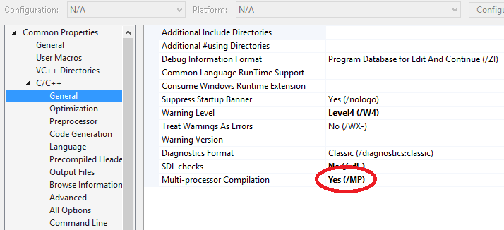
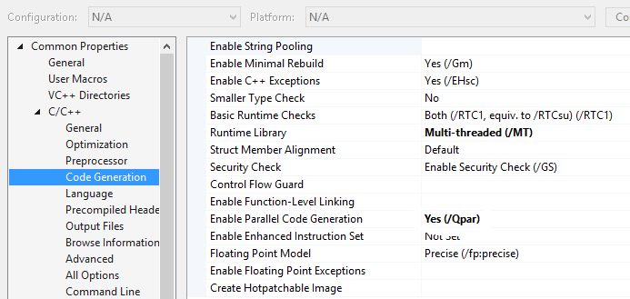
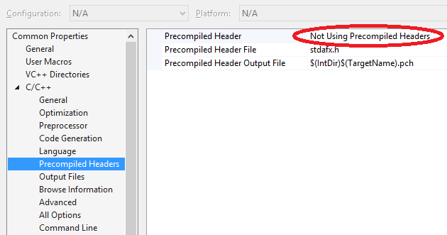
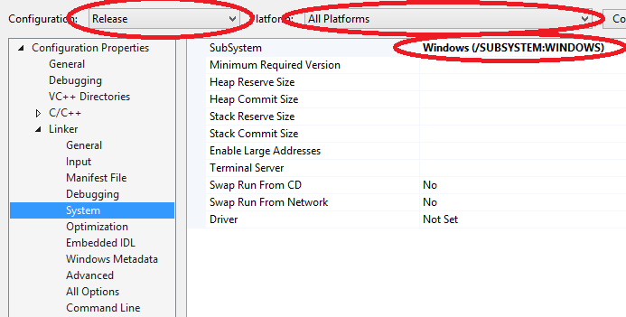

Исходники к этой статье [доступны на github](https://github.com/eligantRU/sfml-sample-doodlejump/tree/master/lyrics)

## `stdafx` и с чем его едят
Представьте, что ваш проект очень и очень большой, вы всюду пишите такие конструкции:
```cpp
#include <string>
#include <vector>
#include <array>
#include <cmath>
// много-много подключений
#include <SFML/Graphics.hpp>
// ещё десяток-другой include
```

Компилятор встречает эти `include` и компилирует всё, что внутри, из-за чего вы теряете время. А ещё вы копипастите. Нравится? Не очень.
Именно для этого и создан `stdafx.h`, в нём вы подключаете всё то, что гарантированно не будет изменяться в процессе разработки(стандартная библиотека и подключаемые библиотеки, например, SFML).
В `stdafx.cpp` вообще ничего не пишем, туда как бы развернутся все подключенные в "хашнике" файлы.
Это позволит компилятору запомнить, что же было подключено ранее. Зачем ему это? Прелесть в том, что вы соберёте проект в первый раз, компилятор соберёт всё то, что есть в `stdafx.h`. А при следующей сборке он уже этого делать не будет, ведь всё, что было подключено в `stdafx.h` не поменялось, зачем делать ещё раз одну и ту же работу? Если появился новый `include` или удалился ненужный, то да, надо дособрать(а ещё, если изменились подключаемые файлы, именно поэтому не стоит подключать там ничего своего). Если ваш проект не столь большой, то да, пользы не так много...но зато нет копипасты, - уже неплохо!
> В одной из предыдущих статей говорилось о том, что нельзя писать `#include "stdafx.h"` в "хашниках", - не забывайте об этом. Причины этого слишком мудрёные, объяснение достойно отдельной статьи, которая не даст особой практической пользы, а потому опустим этот вопрос.

## Ускоряем сборку
Как часто вам приходится встречаться с одноядерными процессорами? Вот с теми, в которых даже второго потока нет и не может быть. Часто? В вашем компьютере не такой? Ну что ж, вам повезло, теперь вы сможете собирать свои проекты, используя всю вычислительную мощность вашего процессора. Идём в Property Manager:



Если оставить всё так, как указано выше в красных эллипсах, то мы получим ошибки, говорящие нам о том, что мы не можем использовать какие-то прекомпилированные заголовки...а это наш `stdafx`. Не вопрос, можем от этого отказаться, всё равно собираться будет значительно быстрее за счёт включения флагов `/MP` и `/Qpar`:


> Не перенимайте настройки, которые не описываются напрямую в статьях, назначение интересующих нас настроек будет описано позднее. Помните, что сломать сборку сразу всех проектов проще всего сделать именно из Property Manager'а,

## Зачем нужна консоль?
Вопрос хороший. Иногда из неё читают значения, иногда туда что-то записываю, например, результат, аннотации или...В конце-концов многие отладочные операторы начинаются с `std::cout <<`. Но нужна ли она нам? В Debug - да, например, для той для отладки. А в Release? Нет. У нас же оконное приложение! Зачем нам консоль рядом с красивым окном? Давайте это исправим!
Идём в настройки проекта:


Таким образом мы отключили консоль в Release сборках в x86 и x64 архитектурах.

## Зависимость от...времени
В самом начале статьи было сказано, что примеры к этой статье можно найти на github, но примеры всё не нужны и не нужны...В чём подвох? И что за странный заголовок? Обо всём по порядку.

В каждом компьютере своя начинка. Даже если взять два одинаковых процессора, окажется, что они разные. Один можно разогнать до больших частот, транзисторов на нём больше, техпроцесс у него меньше и т.д.
Это я так намекаю на то, что на разных компьютерах одно и то же приложение выдаст разный FPS. Но для gamedev'а это очень и очень критично. Один игрок "тормозит", потому что у него железо слабее, чем у его оппонента. В итоге, у одного из них преимущество. Или же, если игра однопользовательская, то на одном компьютере боты вяленькие, главный герой тоже медленный, а на другом все носятся так, что и понять ничего не успеваешь.

По ссылке в самом начале статьи находится программа, рисующая, простите за тавтология, вращающийся по кругу круг со скоростью 90 градусов за секунду. Кстати, при каждом запуске программы цвет круга будет разным, всё благодаря функции генерации случайного цвета.
В этом примере применены часы(`sf::Clock`): в метод `Application::Update` передаётся время в секундах, прошедшее с предыдущего кадра, - что позволяет нам сделать передвижение более плавным.
